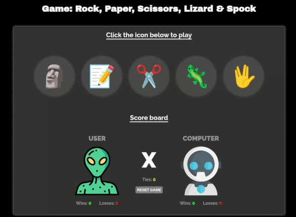

# 🎮 Rock, Paper, Scissors, Lizard & Spock

A web-based version of the classic **Rock, Paper, Scissors** game inspired by **The Big Bang Theory** featuring two additional choices: Lizard and Spock.

## 📖 About the Project

This project allows the player to compete against the computer by choosing one of five possible moves. The computer generates a random move, and the game determines the winner according to the official rules of Rock, Paper, Scissors, Lizard & Spock.

The scoreboard is automatically saved using the browser's **Local Storage**, allowing the player's progress to persist even after refreshing or closing the page.

---

## 🚀 Technologies Used

* HTML5
* CSS3
* JavaScript (Vanilla JS)
* Local Storage API

---

## 🛠️ Features

* Five playable options:

  * 🗿 Rock
  * 📝 Paper
  * ✂️ Scissors
  * 🦎 Lizard
  * 🖖 Spock

* Real-time scoreboard:

  * Wins
  * Losses
  * Ties

* Persistent data storage with Local Storage.

* Responsive design for different screen sizes.

* Pop-up displaying the result of each round.

* Reset button to start a new game.

## 📍 The Process

I've been asking myself what the first project I should upload here, and what could be better than a Rock, Paper, Scissors game with even more options?

I wanted to practice everything I've learned over the past few months, including DOM manipulation, event handling, arrays, objects, functions, data persistence, and responsive design. This project turned out to be the perfect opportunity to do that.

---
## 🎬 Preview/Demo

---
